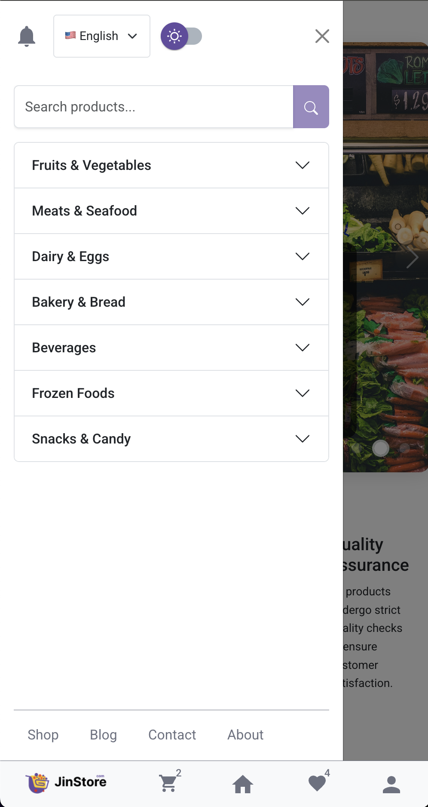
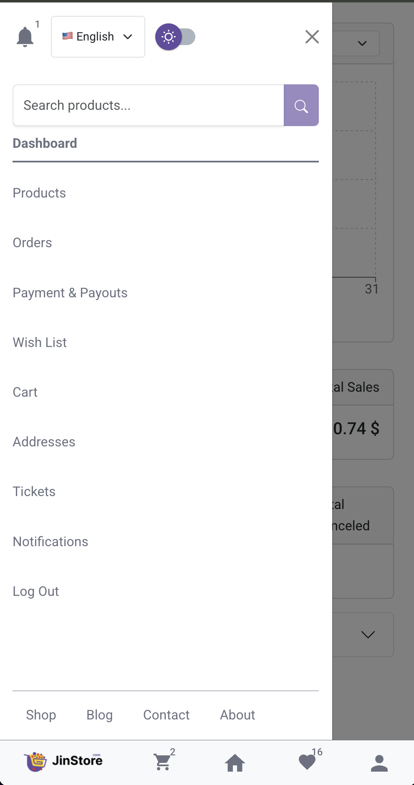

# 🛍️ E-Commerce Marketplace

[](https://github.com/homayoun-asghari/ecommerce)
[](https://github.com/homayoun-asghari/ecommerce/commits/main)

A full-featured e-commerce marketplace built with the PERN stack (PostgreSQL, Express.js, React.js, Node.js) that supports three distinct user roles: Buyers, Sellers, and Administrators. The platform also features a blog system for content sharing and community engagement.

## 🎥 Demo
🔗 [Live Demo – ecommerce.homayoun.me](https://ecommerce.homayoun.me)

<div align="center">
  
  
  
  
  
  
</div>

## 🚀 Features

### 👥 Multi-Role User System

#### 🛒 Buyer Features
- Browse and search products
- Add items to cart and wishlist
- Secure checkout process
- Order tracking and history
- Product reviews and ratings

#### 🏪 Seller Features
- Seller dashboard for managing products
- Add, edit, and remove products
- View and manage orders
- Sales analytics and reports
- Inventory management

#### 👑 Admin Features
- Full system administration
- User management (buyers & sellers)
- Content moderation
- System analytics and reporting
- Platform settings and configurations

#### ✍️ Blog System
- Create and publish blog posts
- Categorize and tag content
- Featured posts
- Search and filter functionality

### 🔐 User Authentication
- Email/Password registration and login
- Google OAuth 2.0 integration
- JWT-based session management
- Password reset functionality

- **Product Management**

  - Product listing with categories and filters
  - Advanced product search
  - Product details with image gallery
  - Product reviews and ratings system

- **Shopping Experience**

  - Shopping cart functionality
  - Wishlist management
  - Order tracking system
  - Responsive design for all devices
  - Multi-language support (English/Turkish)

- **Admin Dashboard**
  - Product CRUD operations
  - User management
  - Order management system
  - Sales analytics and reports
  - Ticket management system

## 🔄 User Roles & Permissions

| Role      | Product Management | Order Management | User Management | Content Management | Blog Access |
|-----------|-------------------|------------------|-----------------|-------------------|-------------|
| Buyer     | View Only         | Own Orders       | Personal        | Read Only         | Full Access |
| Seller    | Full Access       | Own Products     | Personal        | Limited           | Full Access |
| Admin     | Full Access       | All Orders       | Full Access     | Full Access       | Full Access |

## 🛠️ Tech Stack

**Frontend:**

- React.js 19
- React Router 6
- Material-UI 7
- Styled Components 6
- i18next (for internationalization)
- React Context API (for state management)
- React Hook Form (for forms)
- Axios (for API calls)

**Backend:**

- Node.js
- Express.js
- PostgreSQL (with pg client)
- JWT Authentication
- Passport.js (for OAuth)
- Cloudinary (for image storage)
- Nodemailer (for email notifications)
- Bcrypt (for password hashing)

## 🚀 Getting Started

### Prerequisites

- Node.js (v16 or higher)
- npm or yarn
- PostgreSQL (v12 or higher)
- Cloudinary account (for image uploads)
- Google OAuth credentials

### Installation

1. **Clone the repository**

   ```bash
   git clone https://github.com/homayoun-asghari/ecommerce.git
   cd ecommerce
   ```

2. **Install dependencies**

   ```bash
   # Install server dependencies
   cd server
   npm install

   # Install client dependencies
   cd ../client
   npm install
   ```

3. **Set up environment variables**

   - Create a `.env` file in the server directory with the following variables:
     ```
     PORT=5050
     DB_USER=your_db_user
     DB_PASSWORD=your_db_password
     DB_NAME=your_db_name
     DB_HOST=localhost
     DB_PORT=5432
     JWT_SECRET=your_jwt_secret
     CLOUDINARY_CLOUD_NAME=your_cloudinary_cloud_name
     CLOUDINARY_API_KEY=your_cloudinary_api_key
     CLOUDINARY_API_SECRET=your_cloudinary_api_secret
     GOOGLE_CLIENT_ID=your_google_client_id
     GOOGLE_CLIENT_SECRET=your_google_client_secret
     CLIENT_URL=http://localhost:3000
     NODE_ENV=development
     ```

4. **Database setup**

   - Create a new PostgreSQL database
   - Run the database initialization script (if provided)

5. **Start the application**
   ```bash
   # From the root directory
   npm run dev
   ```
   This will start both the server (on port 5050) and the client (on port 3000).

## 📂 Project Structure

```
ecommerce/
├── client/                 # Frontend React application
│   ├── public/             # Static files
│   └── src/
│       ├── components/     # Reusable UI components
│       ├── pages/          # Page components
│       ├── contexts/       # React contexts
│       ├── hooks/          # Custom React hooks
│       ├── layouts/        # Layout components
│       ├── styles/         # Global styles
│       ├── utils/          # Utility functions
│       └── App.js          # Main App component
│
└── server/                # Backend Node.js/Express application
    ├── controllers/       # Route controllers
    ├── middlewares/       # Custom middlewares
    ├── models/            # Database models
    ├── routes/            # API routes
    └── index.js           # Server entry point
```

## 🤝 Contributing

Contributions are always welcome! Please follow these steps:

1. Fork the project
2. Create your feature branch (`git checkout -b feature/AmazingFeature`)
3. Commit your changes (`git commit -m 'Add some AmazingFeature'`)
4. Push to the branch (`git push origin feature/AmazingFeature`)
5. Open a Pull Request

## 📄 License

This project is licensed under the MIT License - see the [LICENSE](LICENSE) file for details.

## ✉️ Contact

Homayoun Asghari - contact@homayoun.me

Project Link: [https://github.com/homayoun-asghari/ecommerce](https://github.com/homayoun-asghari/ecommerce)

## 🙏 Acknowledgments

- [Figma E-commerce Template](https://www.figma.com/community/file/1332692166039368405/75-ecommerce-landing-page-templates) for the design inspiration
- [Material-UI](https://mui.com/) for the amazing UI components
- [React Icons](https://react-icons.github.io/react-icons/) for the icon library
- [React-Bootstrap](https://react-bootstrap.github.io/) for responsive UI components
- [i18next](https://www.i18next.com/) for internationalization
- [Cloudinary](https://cloudinary.com/) for image storage and management
- [Unsplash](https://unsplash.com/) for placeholder images
